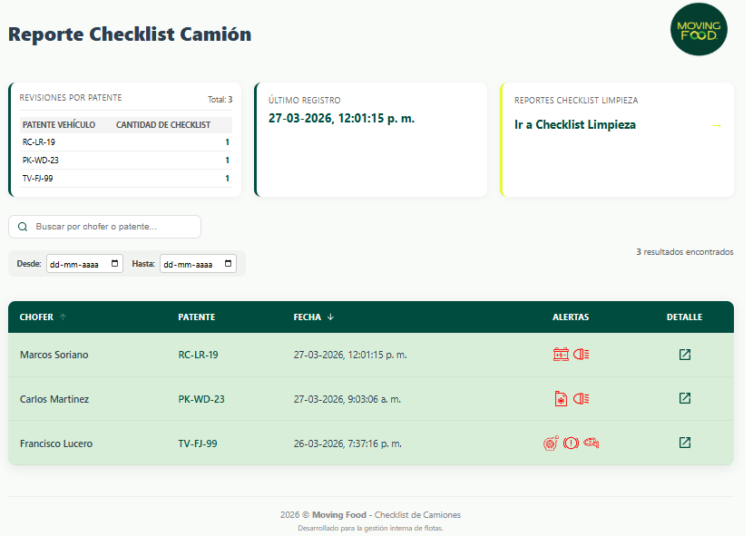

# Dashboard Checklist Camiones - Reportes

Este proyecto es una interfaz administrativa desarrollada en React y Material UI para visualizar, filtrar y auditar los checklists realizados por los operarios de transporte. Permite la revisión detallada de estados críticos (motor, neumáticos, luces) y la visualización de evidencias fotográficas.

## Funcionalidades

* Tabla Dinámica: Visualización de registros con ordenamiento por fecha y chofer.

* Alertas Visuales: Iconografía personalizada que resalta ítems que "Requieren Atención".

* Buscador Universal: Filtro en tiempo real por patente o nombre del conductor.

* Filtro por Fecha: Selección de rangos para auditorías específicas.

* Modal de Detalle: Desglose completo de cada formulario, incluyendo:
-   Visualización de múltiples fotos de evidencia.
-   Renderizado inteligente de selecciones múltiples (Checklist de documentos y kits).
-   Interfaz optimizada para lectura rápida.

## Tecnologías Utilizadas

* Frontend: React.js (Vite/CRA)

* UI Library: Material UI (MUI)

* Backend as a Service: Supabase (PostgreSQL)

* Iconografía: MUI Icons & Custom PNGs

## Instalación y Configuración

1.  [git clone https://github.com/tu-usuario/reporte-checklist-mf.git]
    cd reporte-checklist-mf

2. Instalar dependencias:

    ### npm install

## Estructura del Proyecto

* /src/Componentes: Contiene TablaReportes.jsx (Lógica del Modal y visualización) y Filtros.jsx.

* /src/Servicios: Cliente de conexión a Supabase.

* /src/assets: Iconos de alertas (batería, neumáticos, aceite, etc.).

* /src/Paginas: Contiene Dashboard.jsx, DashboardLimpieza.jsx y DashboardLimpieza.css

## Vista Previa

